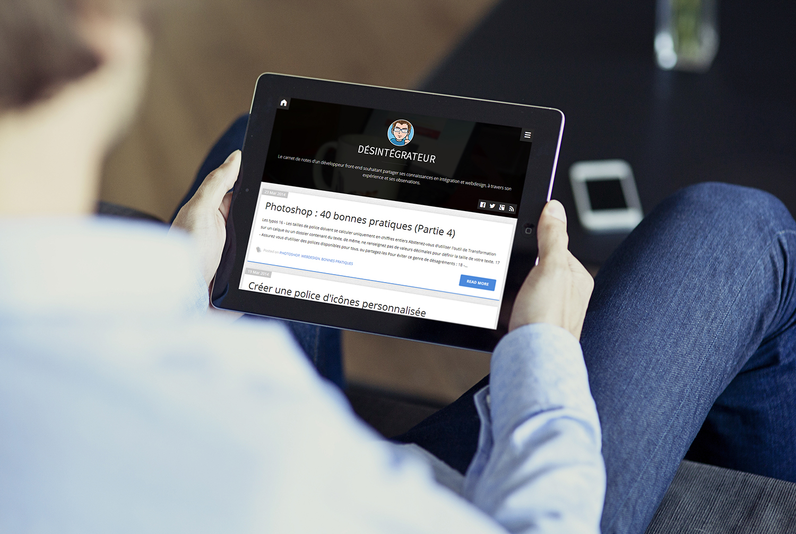
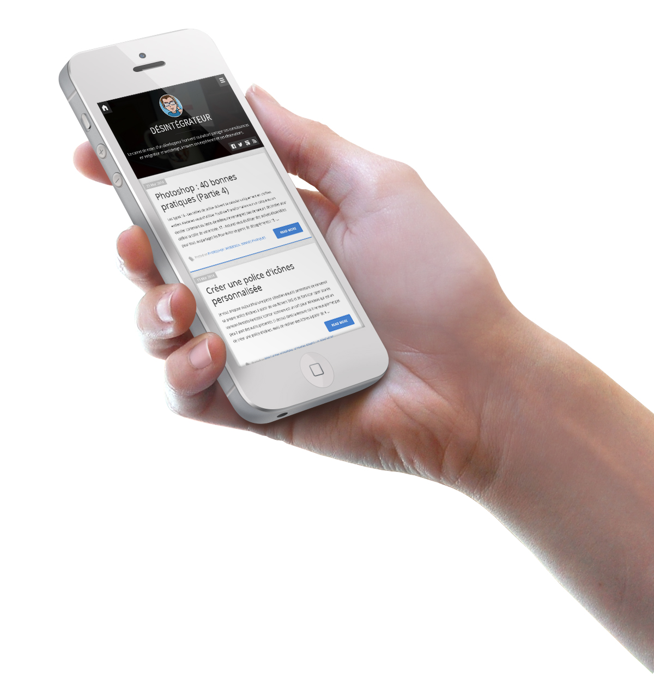

Demo
====

You can view a live demo at www.desintegrateur.fr.

Download
===

Download the theme here : https://github.com/twogrey/ichi/archive/master.zip

About
====

A simple &amp; responsive theme for Ghost

My name is Alexis DEGRYSE. I'm the author of this theme. 
I'm a french front-end developer and I really appreciate Ghost. 
So I decided to create my own free template to understand the structure and logic of Ghost.

If you have any issue to say about this theme, please contact me !

Mail : alexis.degryse@gmail.com

Features
====
* Responsive webdesign (mobile, tablet, laptop, desktop)
* Built with Zurb Foundation
* By default, the sidebar is to the right. If you want it to the left, just add the class .header-left to the body tag
* Menu
* Socials networks (edit default.hbs to manage the display of your socials accounts). By default, there are : facebook, twitter, youtube, google plus, rss (but there are many more, juste check default.hbs) - don't forget to add your URL ID in default.hbs
* Post comments using Disqus - don't forget to add your ID in post.hbs
* Post Cover Image
* Sass/Grunt powered
* Cool 'read more' button
* Editable logo & background
* Facebook/Twitter/G+ share
* Contact support (alexis.degryse@gmail.com)

Installation
====

Download it (https://github.com/twogrey/ichi/archive/master.zip), then load in Ghost Dashboard or copy to theme directory on server.
